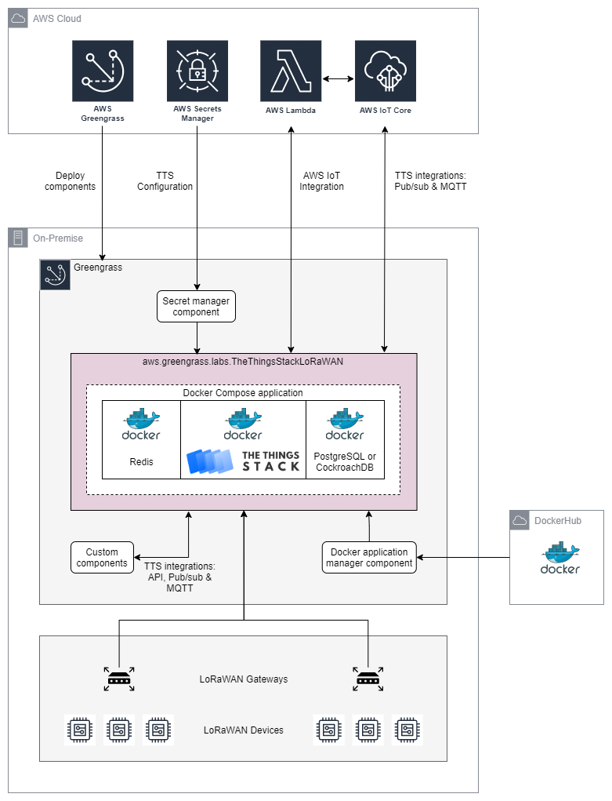

# AWS IoT Greengrass V2 Community Component - The Things Stack LoRaWAN 

[The Things Stack](https://www.thethingsindustries.com/docs/) is an [open-source LoRaWAN stack](https://github.com/TheThingsNetwork/lorawan-stack). Users can deploy the stack as [Open Source](https://hub.docker.com/r/thethingsnetwork/lorawan-stack) (free) or [Enterprise](https://hub.docker.com/r/thethingsindustries/lorawan-stack) (requires a [license](https://accounts.thethingsindustries.com/fee-calculator/)) from images available on Docker Hub.


This repository packages The Things Stack into an AWS IoT Greengrass V2 component named **aws.greengrass.labs.TheThingsStackLoRaWAN**. This component enables use cases where you require a private LoRaWAN Network Server (LNS) at the edge. The Things Stack is also offered as [an AWS Marketplace AMI](https://aws.amazon.com/marketplace/pp/prodview-okhh3ofzhqj56). This Greengrass component is a logical equivalent, but pitching at the edge.


For Enterprise deployments, ingestion into AWS IoT Core can be achieved by deploying [The Things Stack AWS IoT default integration](https://www.thethingsindustries.com/docs/integrations/aws-iot/default/) into your AWS account. For Open Source deployments, [The Things Stack Pub/Sub integration](https://www.thethingsindustries.com/docs/integrations/pubsub/) is a good option for achieving ingestion into AWS IoT Core.

The Pub/Sub integration can also be used to publish and subscribe to topics on the Greengrass local [EMQX MQTT broker](https://docs.aws.amazon.com/greengrass/v2/developerguide/mqtt-broker-emqx-component.html) or [Moquette MQTT broker](https://docs.aws.amazon.com/greengrass/v2/developerguide/mqtt-broker-moquette-component.html). This allows integration with the cloud, other Greengrass components on the same device and/or with other devices on the local network. The Things Stack can therefore leverage [AWS-managed Greengrass components](https://docs.aws.amazon.com/greengrass/v2/developerguide/public-components.html), [custom Greengrass components](https://docs.aws.amazon.com/greengrass/v2/developerguide/develop-greengrass-components.html), [community Greengrass components](https://github.com/orgs/awslabs/teams/aws-greengrass-labs/repositories) and AWS services to deliver powerful edge solutions that extend The Things Stack's capabilities.

# Table of Contents
* [Architecture](#architecture)
* [Repository Contents](#repository-contents)
* [Requirements and Prerequisites](#requirements-and-prerequisites)
  * [Greengrass Core Device](#greengrass-core-device)
    * [Platform](#platform)
    * [Edge Runtime](#edge-runtime)
    * [Docker Requirements](#docker-requirements)
    * [Python Requirements](#python-requirements)
  * [Greengrass Cloud Services](#greengrass-cloud-services)
    * [Core Device Role](#core-device-role)
  * [Developer Machine](#developer-machine)
    * [AWS CLI](#aws-cli)
    * [cfssl](#cfssl)
    * [Python](#python)
    * [GDK CLI](#gdk-cli)
    * [Bash](#bash)
    * [yq](#yq)
* [Getting Started](#getting-started)
  * [Quickstart](#quickstart)
  * [Slowstart](#slowstart)
    * [Manual Deployment](#manual-deployment)
    * [Example Execution](#example-execution)
    * [CI/CD Pipeline](#cicd-pipeline)
    * [Automated Testing](#automated-testing)
* [The Things Stack Configuration Tips](#the-things-stack-configuration-tips)
  * [Defaults](#defaults)
  * [Enterprise versus Open Source](#enterprise-versus-open-source)
  * [Pub/Sub Integration](#pubsub-integration)
    * [AWS IoT Core](#aws-iot-core)
    * [Greengrass MQTT Broker](#greengrass-mqtt-broker)
* [Operations](#operations)
  * [Clean Uninstall](#clean-uninstall)
  * [Data Backup](#data-backup)
* [Troubleshooting](#troubleshooting)
  * [Troubleshooting Tools](#troubleshooting-tools)
    * [Core Device Log Files](#core-device-log-files)
    * [Greengrass CLI](#greengrass-cli)
    * [Docker Container Logs](#docker-container-logs)
  * [Common Failures](#common-failures)
    * [Wrong Docker Image Architecture](#wrong-docker-image-architecture)
    * [Configuration Changes Not Deployed](#configuration-changes-not-deployed)
* [Development](#development)
  * [Static Analysis](#static-analysis)
  * [Unit Tests](#unit-tests)

# Architecture

An overview of the system architecture is presented below.



The **aws.greengrass.labs.TheThingsStackLoRaWAN** component is a thin wrapper around a conventional The Things Stack deployment. The Things Stack is composed of multiple Docker containers, using Docker Compose. Subject to configuration, there may be a Redis container and a PostreSQL container, in addition to The Things Stack container.

The Things Stack is delivered as Docker images on Docker Hub. This component downloads Docker images from Docker Hub with the help of the [Docker application manager](https://docs.aws.amazon.com/greengrass/v2/developerguide/docker-application-manager-component.html) component.

The Things Stack configuration includes sensitive information. Accordingly, the configuration is stored as a secret in [AWS Secrets Manager](https://aws.amazon.com/secrets-manager/). This component gets its configuration from Secrets Manager with the help of the [Secret manager](https://docs.aws.amazon.com/greengrass/v2/developerguide/secret-manager-component.html) component. 

The Things Stack offers [an API](https://www.thethingsindustries.com/docs/getting-started/api/) and various [integrations](https://www.thethingsindustries.com/docs/integrations/) that can be used for remote ingestion or control, or can be used by other Greengrass components to achieve local data processing and actions. 

For Enterprise deployments, ingestion into AWS IoT Core can be best achieved by deploying [The Things Stack AWS IoT default integration](https://www.thethingsindustries.com/docs/integrations/aws-iot/default/) into your AWS account. This is option is shown in **green** on the architecture diagram.

As shown in **blue**, The Things Stack can use its [Pub/Sub integration](https://www.thethingsindustries.com/docs/integrations/pubsub/) to connect directly to AWS IoT Core. This option would typically only be used for deployments of the Open Source edition of The Things Stack. Alternatively, and more powerfully, the Pub/Sub integration can instead connect to the local Greengrass [EMQX MQTT broker](https://docs.aws.amazon.com/greengrass/v2/developerguide/mqtt-broker-emqx-component.html) or [Moquette MQTT broker](https://docs.aws.amazon.com/greengrass/v2/developerguide/mqtt-broker-moquette-component.html). This is option is shown in **red**. If The Things Stack and other TCP/IP devices on the local network are registered as [Local Client Devices with Greengrass](https://aws.amazon.com/blogs/iot/implementing-local-client-devices-with-aws-iot-greengrass/), this architecture allows The Things Stack to communicate with those [other devices via the broker](https://docs.aws.amazon.com/greengrass/v2/developerguide/interact-with-local-iot-devices.html) **and** with AWS IoT Core and other Greengrass components via the [MQTT bridge](https://docs.aws.amazon.com/greengrass/v2/developerguide/mqtt-bridge-component.html) and [Greengrass Interprocess Communication](https://docs.aws.amazon.com/greengrass/v2/developerguide/ipc-publish-subscribe.html).

# Repository Contents

| Item                          | Description                                                                                           |
| ----------------------------- | ----------------------------------------------------------------------------------------------------- |
| /artifacts                    | Greengrass V2 component artifacts that run on the Greengrass edge runtime.                            |
| /cicd                         | CDK Typescript app for a CodePipeline CI/CD pipeline.                                                 |
| /images                       | Images for README files.                                                                              |
| /libs                         | Python libraries shared by Python scripts.                                                            |
| /robot                        | Robot Framework integration tests.                                                                    |
| /tests                        | Pytest unit tests.
| /tts-config                   | The Things Stack configuration files.                                                                 |
| create_certs.sh               | Creates self-signed TLS certificates for a given domain name or IP address.                           |
| create_config_minimal.py      | Creates a minimal configuration needed to deploy the component for a given domain name or IP address. |
| create_config_secret.py       | Creates or updates The Things Stack configuration secret in Secrets Manager.                          |
| deploy_component_version.py   | Deploys a component version to the Greengrass core device target.                                     |
| gdk_build.py                  | Custom build script for the Greengrass Development Kit (GDK) - Command Line Interface.                |
| gdk-config.json               | Configuration for the Greengrass Development Kit (GDK) - Command Line Interface.                      |
| quickstart.sh                 | Creates and deploys a component with default configuration for a given domain name or IP address.     |
| recipe.yaml                   | Greengrass V2 component recipe template.                                                              |

# Requirements and Prerequisites

## Greengrass Core Device

### Platform

This component requires that the Greengrass device be running a Linux operating system. It [supports all architectures supported by Greengrass itself](https://docs.aws.amazon.com/greengrass/v2/developerguide/setting-up.html#greengrass-v2-supported-platforms).

### Edge Runtime

The [Greengrass edge runtime needs to be deployed](https://docs.aws.amazon.com/greengrass/v2/developerguide/getting-started.html) to a suitable machine, virtual machine or EC2 instance. Please see The Things Stack stated [prerequisites](https://www.thethingsindustries.com/docs/getting-started/installation/) for guidance on the resources required. For a small number of devices and gateways, the processing and memory requirements are small.

The Greengrass machine or instance should not be running any process that uses any [ports that may be needed by The Things Stack](https://www.thethingsindustries.com/docs/reference/networking/). The specific ports used depends on your particular configuration of The Things Stack. The configuration generated by **quickstart.sh** requires ports 443, 1700, 6379, 8881, 8882, 8883, 8884, 8885, 8887, 26256 and 26257 to be available.

### Docker Requirements

The Things Stack is [generally composed as an application with multiple Docker containers](https://www.thethingsindustries.com/docs/getting-started/installation/configuration/), using Docker Compose. Images are obtained from Docker Hub.

Therefore your core device must [meet the requirements to run Docker containers using Docker Compose and Docker Hub](https://docs.aws.amazon.com/greengrass/v2/developerguide/run-docker-container.html).

Not all releases of these third-party container images support all Greengrass architectures. Care must be taken to select appropriate images and releases to suit your target architecture.

### Python Requirements

This component requires both **python3** and **pip3** to be installed on the core device.

## Greengrass Cloud Services

### Core Device Role

Assuming the bucket name in **gdk-config.json** is left unchanged, this component downloads artifacts from an S3 bucket named **greengrass-tts-lorawan-REGION-ACCOUNT**. Therefore your Greengrass core device role must allow the **s3:GetObject** permission for this bucket. For more information: https://docs.aws.amazon.com/greengrass/v2/developerguide/device-service-role.html#device-service-role-access-s3-bucket

Additionally, this component downloads sensitive The Things Stack configuration from Secrets Manager. Therefore your Greengrass core device role must also allow the **secretsmanager:GetSecretValue** permission for the **greengrass-tts-lorawan-ID** secret. 

Policy template to add to your device role (substituting correct values for ACCOUNT, REGION and ID):

```
{
  "Version": "2012-10-17",
  "Statement": [
    {
      "Effect": "Allow",
      "Action": [
        "s3:GetObject"
      ],
      "Resource": "arn:aws:s3:::greengrass-tts-lorawan-REGION-ACCOUNT/*"
    },
    {
      "Effect": "Allow",
      "Action": [
        "secretsmanager:GetSecretValue"
      ],
      "Resource": "arn:aws:secretsmanager:REGION:ACCOUNT:secret:greengrass-tts-lorawan-ID"
    }
  ]
}
```

## Developer Machine

### AWS CLI

The AWS CLI should be installed.

### cfssl

If you wish to generate your own self-signed TLS certificates for your domain, or use **quickstart.sh**, then [cfssl](https://github.com/cloudflare/cfssl) is required. Example installation on an Ubuntu or Debian machine:

```
sudo apt update
sudo apt install -y golang-cfssl
```

Or using Homebrew (Mac or Linux):

```
brew install cfssl
```

Alternatively consider installing from [released binaries](https://github.com/cloudflare/cfssl/releases) available in the [cfssl GitHub repository](https://github.com/cloudflare/cfssl). Windows installation executables are available.

### Python

Most of the scripts in this repository are Python scripts. They are Python 3 scripts and hence **python3** and **pip3** are required.

Package dependencies can be resolved as follows:

```
pip3 install -r requirements.txt
pip3 install -r robot/requirements.txt
```

Please consider to use a [virtual environment](https://docs.python.org/3/library/venv.html).

[Boto3](https://boto3.amazonaws.com/v1/documentation/api/latest/index.html) is included in the package dependencies and therefore your machine requires appropriate [credentials](https://boto3.amazonaws.com/v1/documentation/api/latest/guide/credentials.html).

### GDK CLI

This component makes use of the [Greengrass Development Kit (GDK) - Command Line Interface (CLI)](https://github.com/aws-greengrass/aws-greengrass-gdk-cli). This can be installed as follows:

```
pip3 install git+https://github.com/aws-greengrass/aws-greengrass-gdk-cli.git
```

### Bash

The **quickstart.sh** and **create_certs.sh** scripts are Bash scripts. If using a Windows machine, you will need a Bash environment.

### yq

The **yq** utility is used by **quickstart.sh**. Installation instructions and release packages for Linux, OS X and Windows are available on the [yq](https://github.com/mikefarah/yq) site.

# Getting Started

You can choose between two ways to get started: Quickstart or Slowstart.

All scripts are compatible with Linux, Mac or Windows operating systems, provided a Bash environment is available.

## Quickstart

The **quickstart.sh** bash script is supplied to help you get going fast. For experimentation in non-production settings.

Before running the script, users must:

1. Deploy Greengrass V2 to a Linux machine, virtual machine or EC2 instance.
2. Initialize the Greengrass core device to satisfy the [the requirements to run Docker containers using Docker Compose and Docker Hub](https://docs.aws.amazon.com/greengrass/v2/developerguide/run-docker-container.html).
3. Install **cfssl** and **yq** on the developer machine.
4. Set the AWS region in **gdk-config.json**.

The Quickstart script will:

1. Install required Python packages if you haven't already. (Activate a Python virtual environment before running the script.)
2. Create self-signed certificates for a given domain name or IP address.
3. Create a minimal The Things Stack configuration for the given domain name or IP address.
4. Upload the secure configuration to a configuration secret in Secrets Manager.
5. Use GDK to build the component.
6. Use GDK to publish a new component version to Greengrass cloud services and upload artifacts to an S3 bucket.
7. Prompt you to add permissions for the configuration secret and artifacts bucket to the Greengrass core device role. 
8. Deploy the new component version to the Greengrass core (creating The Things Stack admin user in the process).
9. Run Robot Framework integration tests to confirm The Things Stack is running under Greengrass.

The script accepts 4 arguments:

1. Domain name or IP address (this can be an EC2 default domain name).
2. The password of The Things Stack admin user that will be created.
3. The email of The Things Stack admin user that will be created.
4. Greengrass Core device name.

Example execution:

```
bash quickstart.sh example.com mypassword user@example.com GGTheThingsStackLoRaWAN
```
## Slowstart

For any serious use of the component, Quickstart shall not be appropriate.

### Manual Deployment

If not using Quickstart, you must perform the following steps:

1. Deploy the Greengrass runtime to your machine, virtual machine or EC2 instance. This should be a Linux machine, but can be of any architecture. 
2. Configure the LoRaWAN stack as per https://www.thethingsindustries.com/docs/getting-started/installation/configuration/. Take care to select Docker images with the correct architecture. 
3. Configure certificates as per https://www.thethingsindustries.com/docs/getting-started/installation/certificates/.
4. If BYO/generating custom TLS certificates (rather than using Lets Encrypt), then add them to the **/tts-config** directory.
5. If using an Enterprise license file, add it to the **/tts-config** directory.
6. Set the AWS region in **gdk-config.json**.
7. Run **create_config_secret.py** to create the configuration secret in Secrets Manager.
8. Run **gdk component build** to build the component.
9. Run **gdk component publish** to create a component version in Greengrass cloud service, and upload artifacts to S3.
10. Add permissions for the configuration secret and artifacts bucket to the Greengrass core device role. 
11. he component can then be deployed using [the console or using the AWS CLI](https://docs.aws.amazon.com/greengrass/v2/developerguide/create-deployments.html) in the normal way. Alternatively it can be deployed using the supplied **deploy_component_version.py** script.

For iterative configuration changes, repeat steps 2 and 7. For iterative component changes, repeat steps 8, 9 and 11.


### Example Execution

Example of steps 7, 8, 9 and 11:

```
python3 create_config_secret.py mypassword user@example.com
gdk component build
gdk component publish
python3 deploy_component_version.py 1.0.0 MyCoreDeviceThingName
```

This example:

1. Creates a Secrets Manager secret in your account in the region specified in **gdk-config.json**.
2. Sets the admin user for The Things Stack to have password **mypassword** and email **user@example.com**.
3. Builds the component and publishes it to your account in the region specified in **gdk-config.json**. 
4. Deploys the new component version to Greengrass core device **MyCoreDeviceThingName**.

### CI/CD Pipeline

This repository offers a CodePipeline [CI/CD pipeline](cicd/README.md) as a CDK application. This can be optionally deployed to the same account as the Greengrass core.

This CI/CD pipeline automates steps 8, 9 and 11. Following deployment, it performs automated smoke tests to ensure that The Things Stack has started correctly. 

### Automated Testing

This repository includes an [automated test suite](robot/README.md) built on top of [Robot Framework](https://robotframework.org/). This can be run on demand from the command-line but it is also included as part of the CI/CD pipeline.

# The Things Stack Configuration Tips

Configuration of the LoRaWAN stack is mainly an exercise in editing **tts-config/docker-compose.yaml** and **tts-config/config/stack/ttn-lw-stack-docker.yml**. Please consult [The Things Stack configuration documentation](https://www.thethingsindustries.com/docs/getting-started/installation/configuration/) for details.

## Defaults

The **tts-config/docker-compose.yaml** and **tts-config/config/stack/ttn-lw-stack-docker.yml** files in this repository are The
Things Stack Enterprise example configuration files, with the following divergence:

- All Enterprise configuration elements are commented out so that it defaults to Open Source edition.
- Acme Let's Encrypt TLS certificates are disabled and custom TLS certificates are enabled. This allows deployment to a server that only has an IP address, a local network DNS name or an EC2 default domain name.
- All non-TLS ports and endpoints are disabled.
- Versioned image tags are used instead of just **latest** tags. These versioned tags are the most recently tested combination. The **latest** tags do not always support as many architectures as formal releases do.

These default settings likely facilitate minimal effort in deploying this component to your Greengrass core device.

## Enterprise versus Open Source

As compared to Open Source, an Enterprise license adds:

- [Device Claim Server](https://www.thethingsindustries.com/docs/devices/device-claiming/)
- Multi-tenant support
- [Storage Integration](https://www.thethingsindustries.com/docs/integrations/storage/)
- [AWS IoT Default Integration](https://www.thethingsindustries.com/docs/integrations/cloud-integrations/aws-iot/default/) support
- Support plan

## Pub/Sub Integration

### AWS IoT Core

The [Pub/Sub integration](https://www.thethingsindustries.com/docs/integrations/pubsub/) can be used to achieve ingestion into AWS IoT Core. This is particularly useful for the Open Source edition of the stack since the [The Things Stack AWS IoT default integration](https://www.thethingsindustries.com/docs/integrations/aws-iot/default/) is only available for Enterprise deployments. 

Firstly create a Thing representing The Things Stack, and obtain the device certificate, private key and CA certificate. 

Obtain the AWS IoT Core endpoint:

```bash
aws iot describe-endpoint --endpoint-type iot:Data-ATS
{
    "endpointAddress": "ENDPOINTID-ats.iot.REGION.amazonaws.com"
}
```

Add a Pub/Sub integration in your Application in The Things Stack with the following settings:

| Item                                      | Value                                                               |
| ----------------------------------------- | ------------------------------------------------------------------- |
| Provider                                  | MQTT                                                                |
| MQTT Configuration: Use secure connection | Enabled                                                             |
| MQTT Configuration: Root CA certificate   | Root CA saved when creating the Thing in AWS IoT Core               |
| MQTT Configuration: Client certificate    | Device certificate saved when creating the Thing in AWS IoT Core    |
| MQTT Configuration: Client private key    | Private key saved when creating the Thing in AWS IoT Core           |
| MQTT Configuration: Server URL            | mqtts://ENDPOINTID-ats.iot.ap-REGION.amazonaws.com:8883             |

### Greengrass MQTT Broker

Greengrass V2 includes two AWS-managed brokers, the [EMQX MQTT broker component](https://docs.aws.amazon.com/greengrass/v2/developerguide/mqtt-broker-emqx-component.html) and the [Moquette MQTT broker component](https://docs.aws.amazon.com/greengrass/v2/developerguide/mqtt-broker-moquette-component.html). Either of these can be deployed to Greengrass to [allow Greengrass components and devices on your local network to communicate with each other](https://docs.aws.amazon.com/greengrass/v2/developerguide/interact-with-local-iot-devices.html), without relying on an internet connection to AWS IoT Core.

Using the [Pub/Sub integration](https://www.thethingsindustries.com/docs/integrations/pubsub/), The Things Stack can be a "local IoT device" that connects to the EMQX or Moquette broker. Additionally, Greengrass V2 includes an [AWS-managed MQTT Bridge component](https://docs.aws.amazon.com/greengrass/v2/developerguide/mqtt-bridge-component.html). When this is also deployed, The Things Stack can use its Pub/Sub Integration to communicate with local devices, Greengrass components and AWS IoT Core; the best of all worlds.

By default, The Things Stack deploys an [MQTT Server](https://www.thethingsindustries.com/docs/integrations/mqtt/) on port **8883**. Prior to deploying the Greengrass MQTT broker you must:

1. Remove the MQTT Server from The Things Stack configuration (and re-publish the configuration secret) OR
2. Move the MQTT Server to a port other than **8883** in The Things Stack configuration (and re-publish the configuration secret) OR
3. Decide to modify the Greengrass MQTT broker component default configuration to run it on a port other than **8883**

Next, [update the Greengrass deployment to add the necessary components](https://docs.aws.amazon.com/greengrass/v2/developerguide/client-devices-tutorial.html) to your Greengrass core device:

* [MQTT broker (EMQX)](https://docs.aws.amazon.com/greengrass/v2/developerguide/mqtt-broker-emqx-component.html) or [MQTT broker (Moquette)](https://docs.aws.amazon.com/greengrass/v2/developerguide/mqtt-broker-moquette-component.html)
* [MQTT bridge](https://docs.aws.amazon.com/greengrass/v2/developerguide/mqtt-bridge-component.html)
* [Client device auth](https://docs.aws.amazon.com/greengrass/v2/developerguide/client-device-auth-component.html)
* [IP detector](https://docs.aws.amazon.com/greengrass/v2/developerguide/ip-detector-component.html)

You will then need to:

1. Create a Thing representing The Things Stack, and obtain the device certificate and private key.
2. [Associate](https://docs.aws.amazon.com/greengrass/v2/developerguide/associate-client-devices.html) this Thing with your Greengrass core device.
3. [Configure the Client device auth component](https://docs.aws.amazon.com/greengrass/v2/developerguide/client-device-auth-component.html#client-device-auth-component-configuration) to define what The Things Stack is authorized to do.
4. [Configure the MQTT Bridge component](https://docs.aws.amazon.com/greengrass/v2/developerguide/mqtt-bridge-component.html#mqtt-bridge-component-configuration) to define the desired message relaying.

You can then configure the Pub/Sub integration settings as described above for AWS IoT Core, but with the following adjustments:

1. The Server URL should be the IP address of the Greengrass core device.
2. Use [your own certificate authority (CA)](https://docs.aws.amazon.com/greengrass/v2/developerguide/connecting-to-mqtt.html#use-your-own-CA), configure the [Client device auth](https://docs.aws.amazon.com/greengrass/v2/developerguide/client-device-auth-component.html) component to use it, and configure the Pub/Sub integration to use that as the CA certificate to validate the broker.

# Operations

## Clean Uninstall

Removing this component from your deployment will not remove all vestiges from your Greengrass core device. You need to also remove the working directory: **/greengrass/v2/work/aws.greengrass.labs.TheThingsStackLoRaWAN**. This also deletes the databases.

## Data Backup

If this component is deployed with default settings, the databases are located in **/greengrass/v2/work/aws.greengrass.labs.TheThingsStackLoRaWAN/.env/data**.

# Troubleshooting

Tips for investigating failed deployments, or deployments that succeed but the Things Stack is still not running.

## Troubleshooting Tools

### Core Device Log Files

Detailed component logs can be found on the Core Device in **/greengrass/v2/logs/aws.greengrass.labs.TheThingsStackLoRaWAN.log**.

The Greengrass Core log file can be found at **/greengrass/v2/logs/greengrass.log**.

For more information please refer to the Greengrass V2 documentation: https://docs.aws.amazon.com/greengrass/v2/developerguide/monitor-logs.html

### Greengrass CLI

Consider to install the [Greengrass Command Line Interface component](https://docs.aws.amazon.com/greengrass/v2/developerguide/gg-cli.html) to obtain greater visibility into the state of your core device.

### Docker Container Logs

The logs within the Docker containers can be inspected as follows:

```
docker logs awsgreengrasslabsthethingsstacklorawan_redis-1
docker logs awsgreengrasslabsthethingsstacklorawan_postgres-1
docker logs awsgreengrasslabsthethingsstacklorawan_stack
```

## Common Failures

The Things Stack can fail to start for a variety of reasons.

### Wrong Docker Image Architecture

If a Docker image of the wrong architecture is deployed, it will fail to start. A message similar to the following indicates that the wrong architecture is being used:

```
standard_init_linux.go:228: exec user process caused: exec format error
```

In the case of The Things Stack container, this message will appear in **/greengrass/v2/logs/aws.greengrass.labs.TheThingsStackLoRaWAN.log**. For the database containers, this message will appear in the Docker container logs. Other consequential errors will appear in **/greengrass/v2/logs/aws.greengrass.labs.TheThingsStackLoRaWAN.log**.

To resolve incorrect architecture, please check the available architectures for the image tag. Image tags on DockerHub do not always support all architectures. Update **docker-compose.yml** and update the configuration secret.

### Configuration Changes Not Deployed

The Greengrass Secret Manager component fetches the configuration secret from the cloud when the component starts up. If you change the value of the secret, you need to deploy a new component version, restart Greengrass, or reboot the core device to refresh the value.

The deployed configuration can be found at **/greengrass/v2/work/aws.greengrass.labs.TheThingsStackLoRaWAN/docker-compose.yml** and **/greengrass/v2/work/aws.greengrass.labs.TheThingsStackLoRaWAN/config/stack/ttn-lw-stack-docker.yml**.

# Development

## Static Analysis

Static analysis is performed using [Pylint](https://pylint.org/). Example execution:

```
pylint artifacts libs tests *.py
```

## Unit Tests

Unit tests are performed using [pytest](https://pytest.org/).

Example execution:

```
pytest --cov=artifacts --cov=.
```

Producing an HTML coverage report into the **htmlcov** directory:

```
pytest --cov=artifacts --cov=. --cov-report=html
```

Producing a coverage report for just the on-device artifacts (100% coverage):

```
pytest --cov=artifacts
```
