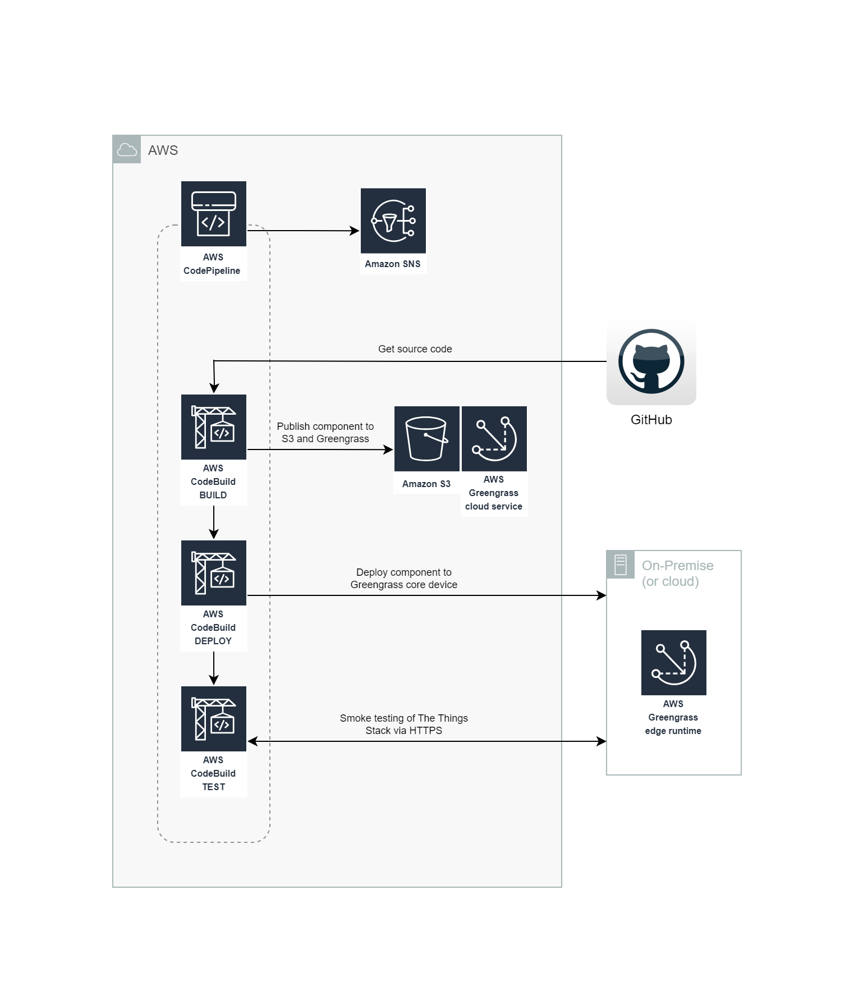

# CI/CD Pipeline Stack

The CI/CD pipeline for the AWS Greengrass The Things Stack LoRaWAN component is a TypeScript CDK application that deploys a CodePipeline pipeline. 

# Table of Contents
* [Architecture](#architecture)
* [How to](#how-to)
    * [Prerequisites](#prerequisites)
    * [Build the application](#build-the-application)
    * [Run unit tests](#run-unit-tests)
    * [Context variables](#context-variables)
    * [Synthesize a CloudFormation template](#synthesize-a-cloudformation-template)
    * [Deploy the pipeline](#deploy-the-pipeline)

# Architecture

The pipeline consists of three stages: build, deploy and test. The build stage creates a new component version, the deploy stage deploys that version to the Greengrass Edge runtime and the test stage performs system-level smoke tests to ensure that The Things Stack has started up correctly. 



Source code is obtained from CodeCommit in the same region as what the pipeline is deployed. Therefore it's necessary to clone the code to a CodeCommit repository. Alternatively you can modify the pipeline to obtain the source code from a different repository.

The pipeline automatically increments the component version number by assigning the build stage CodeBuild build number as the patch revision of the **major.minor.patch** version. Major and minor revision updates are achieved by changing **buildspec.yml**.

The test stage does not modify The Things Stack databases and therefore the pipeline is generally appropriate for DEV, TEST and PROD environments. Testing is performed with the help of [Robot Framework](https://robotframework.org/), with logs stored as build artifacts and [JUnit compatible reports in CodeBuild](https://docs.aws.amazon.com/codebuild/latest/userguide/test-reporting.html). 

The pipeline publishes success or failure notifications to an SNS topic.

# How to

## Prerequisites

Follow the [Getting started with the AWS SDK guide (for Typescript)](https://docs.aws.amazon.com/cdk/latest/guide/getting_started.html) to install CDK and bootstrap your environment.

## Build the application

Compile TypeScript to JS.

```
npm run build
```
## Run unit tests

Uses the Jest framework.

```
npm run test
```

## Context variables

Synthesis and deployment of the stack requires the following context variables:

| Name                  | Description                                                                             |
| --------------------- | --------------------------------------------------------------------------------------- |
| RepositoryName        | The name of the CodeCommit repository containing the component's source code.           |
| BranchName            | The name of the branch to use within the CodeCommit repository.                         |
| GreengrassCoreName    | The name of the Greengrass Core device that the component shall be deployed to.         |

## Synthesize a CloudFormation template 

Example synthesis:

```
cdk synth -c RepositoryName=aws-greengrass-the-things-stack-lorawan -c BranchName=main -c GreengrassCoreName=GGTheThingsStackLoRaWAN
```
## Deploy the pipeline

Example deployment:

```
cdk deploy -c RepositoryName=aws-greengrass-the-things-stack-lorawan -c BranchName=main -c GreengrassCoreName=GGTheThingsStackLoRaWAN
```
